# splity

A new Flutter project.

## Getting Started
# UI / SCREENSHOTS

<a href="url">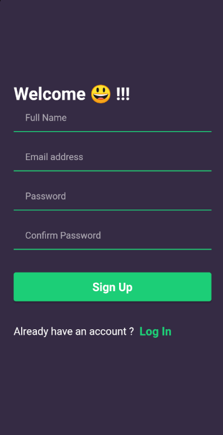</a>
<a href="url">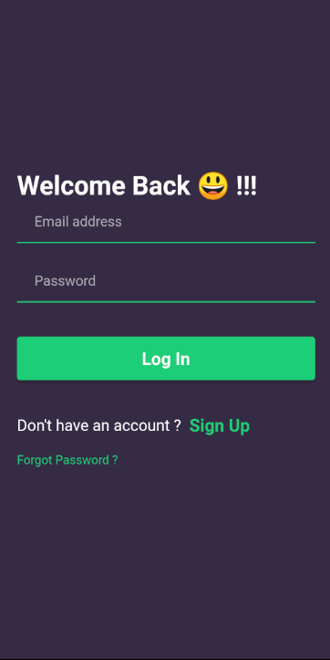</a>
<a href="url">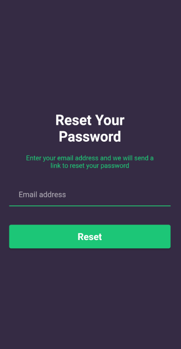</a>
<a href="url">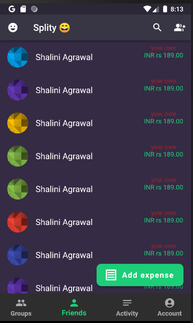</a>
<a href="url">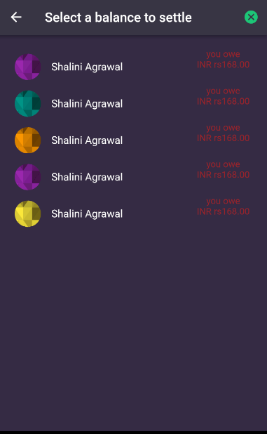</a>
<a href="url">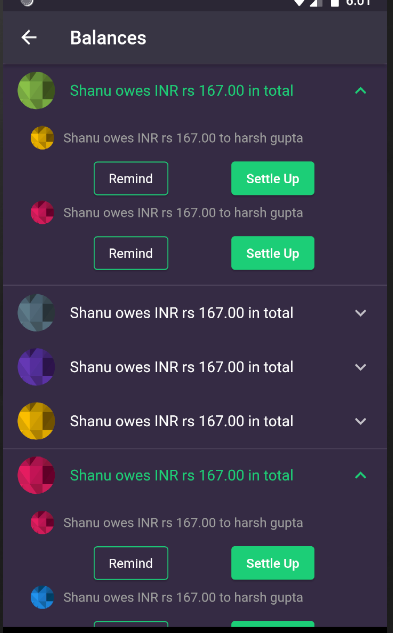</a>
<a href="url">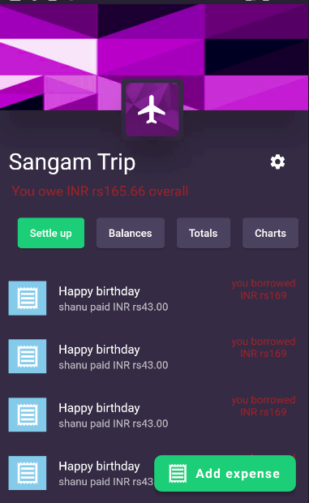</a>
<a href="url">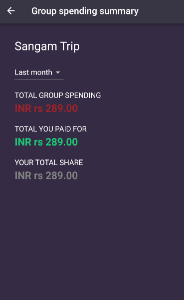</a>
<a href="url">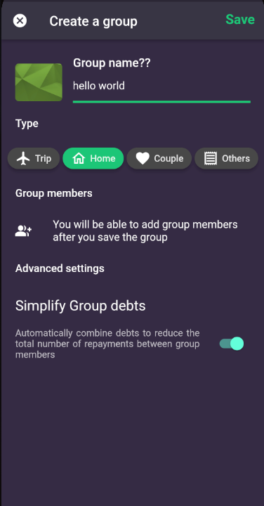</a>
<a href="url">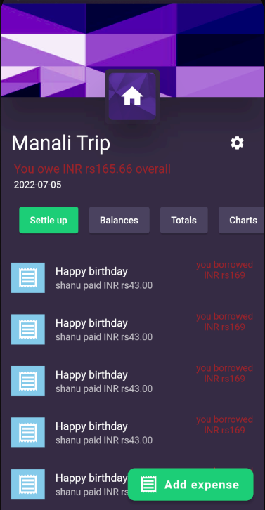</a>
<a href="url">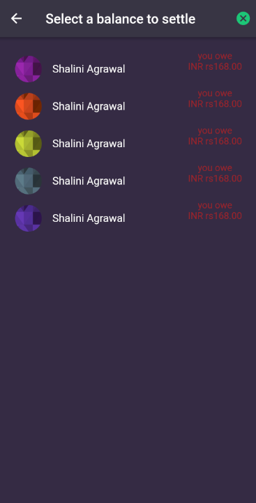</a>
<a href="url">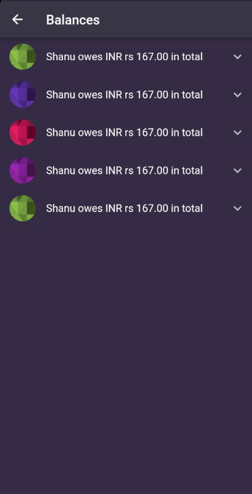</a>
<a href="url">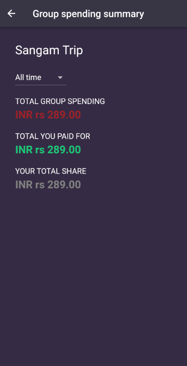</a>
<a href="url">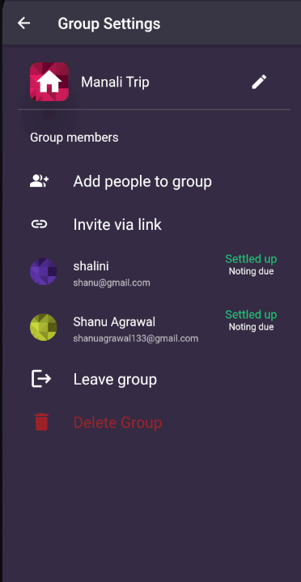</a>
